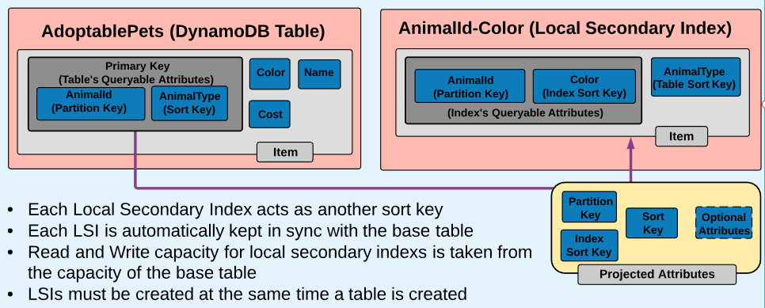

# Local and Global Secondary Indexes

## DynamoDB Secondary Indexes

* Indexes allow efficient queries of non-primary key attributes 
* Every secondary index is associated with only one table 
* Tables can have multiple secondary indexes 
* DynamoDB automatically maintains secondary indexes - when the base table is updated, so are the indexes

## DynamoDB Local Secondary Indexes \(LSIs\) 

Gives you a choice of sort keys for DynamoDB tables LSI Primary Keys are composite keys \(partition and sort key\)

## DynamoDB Global Secondary Indexes \(GSIs\):

Each Global Secondary Index acts as another way to query the information using a different partition and different sort key

